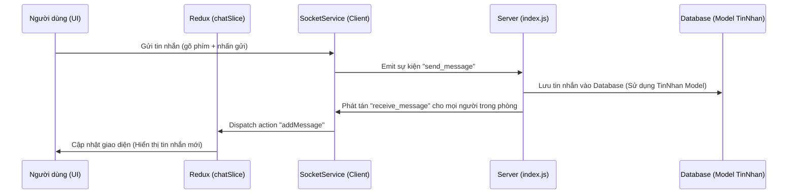

# Tài liệu Kiến trúc Chat Real-time (Socket.io)

Tài liệu này giải thích cách các file trong dự án **WorkBridge** tương tác với nhau để tạo ra tính năng trò chuyện trực tiếp.

## 1. Sơ đồ luồng hoạt động (Data Flow)

## 2. Vai trò của từng File

### A. Phía Client (Frontend)

1.  **`client/src/services/socketService.js`**:
    - **Nhiệm vụ**: Là "đầu mối liên lạc". Nó thiết lập kết nối giữa trình duyệt và Server.
    - **Hành động**: Chứa các hàm để `emit` (gửi đi) và `on` (lắng nghe) các sự kiện như `join_room`, `send_message`.

2.  **`client/src/redux/chatSlice.js`**:
    - **Nhiệm vụ**: Là "trí nhớ tạm thời". Nó lưu trữ danh sách tin nhắn đang hiển thị trên màn hình.
    - **Hành động**: Khi nhận được tin nhắn mới từ Socket, nó sẽ cập nhật mảng `messages` để React vẽ lại giao diện.

3.  **`client/src/pages/chat/Chat.jsx`**:
    - **Nhiệm vụ**: Là "mặt tiền". Nơi người dùng nhìn thấy và tương tác.
    - **Hành động**: Lấy dữ liệu từ Redux để hiển thị và gọi `socketService` khi người dùng nhấn nút Gửi.

---

### B. Phía Server (Backend)

1.  **`server/src/index.js`**:
    - **Nhiệm vụ**: Là "tổng đài điện thoại". Nó điều phối tin nhắn giữa các người dùng.
    - **Hành động**:
      - Khi có người `join_room`: Xếp họ vào đúng nhóm chat.
      - Khi nhận `send_message`: Nhận dữ liệu và chuyển tiếp cho những người khác trong phòng.

2.  **`server/src/models/tinnhan.js`** (Mới được tối ưu):
    - **Nhiệm vụ**: Là "thư ký ghi chép". Nó đảm bảo tin nhắn không bị mất đi.
    - **Hành động**: Cung cấp hàm `sendMessage` để lưu nội dung vào bảng `tinnhan` trong database Supabase.

## 3. Quá trình gửi một tin nhắn diễn ra như thế nào?

1.  **Bước 1**: Bạn gõ "Hello" và nhấn Gửi ở `Chat.jsx`.
2.  **Bước 2**: `Chat.jsx` gọi `socketService.sendMessage("Hello")`.
3.  **Bước 3**: Server (`index.js`) nhận được tin nhắn qua sự kiện `send_message`.
4.  **Bước 4**: Server gọi `TinNhan.sendMessage()` để cất tin nhắn này vào Database (để sau này load lại vẫn còn).
5.  **Bước 5**: Server dùng `io.to(roomId).emit('receive_message')` để gửi tin nhắn này đến tất cả mọi người trong phòng.
6.  **Bước 6**: Máy của người nhận thấy sự kiện `receive_message`, gọi Redux để thêm tin nhắn đó vào màn hình.

---
