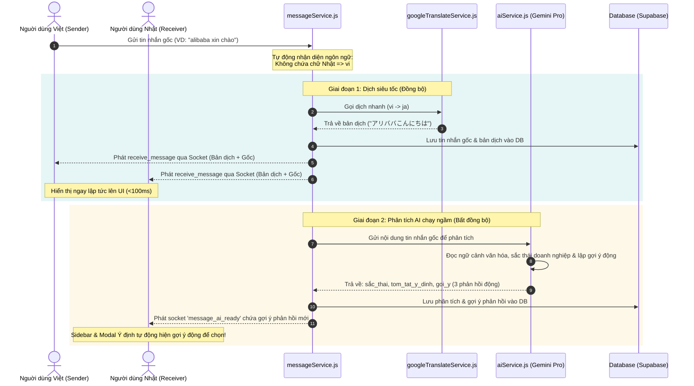

# 🔄 Luồng Dịch Thuật & Phân Tích AI Lai (Hybrid Architecture)

Tài liệu này mô tả chi tiết kiến trúc xử lý tin nhắn lai (Hybrid Message Pipeline) kết hợp giữa **Google Translate (Đồng bộ - Dưới 100ms)** và **Gemini AI (Bất đồng bộ - Chạy ngầm)** được thiết kế để mang lại trải nghiệm chat tức thời nhưng vẫn giữ nguyên khả năng phân tích ngữ cảnh sâu sắc của AI.

---

## 🗺️ Sơ Đồ Quy Trình (Sequence Diagram)



---

## 🛠️ Chi Tiết Các Bước Xử Lý

### Bước 1: Nhận Tin Nhắn & Tự Động Nhận Diện Ngôn Ngữ
* Khi tin nhắn mới đến `messageService.js`, hệ thống kiểm tra sự xuất hiện của các ký tự Nhật Bản bằng Biểu thức chính quy (Regex):
  ```javascript
  const japaneseRegex = /[\u3040-\u309F\u30A0-\u30FF\u4E00-\u9FAF]/;
  ```
* **Nếu phát hiện chữ Nhật:** Ngôn ngữ gốc mặc định là `ja`, đích là `vi`.
* **Nếu không phát hiện chữ Nhật:** Ngôn ngữ gốc mặc định là `vi`, đích là `ja`.

### Bước 2: Dịch Thuật Siêu Tốc Bằng Google Translate (Đồng Bộ)
* Tin nhắn được chuyển qua `googleTranslateService.js` để gọi HTTP trực tiếp đến API Google dịch miễn phí, tốc độ phản hồi cực nhanh dưới **100ms**.
* Bản dịch được lưu ngay vào bảng `ban_dich`.
* Hệ thống thực hiện phát (broadcast) sự kiện `receive_message` lên Socket. Cả người gửi và người nhận sẽ nhìn thấy tin nhắn kèm bản dịch ngay lập tức mà không phải chờ đợi.

### Bước 3: Phân Tích Ý Định & Sinh Gợi Ý Phản Hồi Bằng Gemini (Bất Đồng Bộ)
* Nhờ giải phóng nhiệm vụ dịch thuật cho Google Translate, mô hình **Gemini AI** giờ đây chạy hoàn toàn trong nền để không gây tắc nghẽn luồng nhắn tin chính.
* Gemini Pro phân tích tin nhắn gốc dựa trên chiều sâu văn hóa Việt - Nhật:
  * Xác định sắc thái (`thân mật`, `lịch sự`, `kính ngữ`...).
  * Tóm tắt ý định cốt lõi của người gửi.
  * Thiết kế **3 câu gợi ý phản hồi động** phù hợp với ngữ cảnh hiện tại.
* Dữ liệu phân tích được lưu vào bảng `phan_tich_y_nghia` và phát sự kiện `message_ai_ready` qua Socket tới Frontend để cập nhật giao diện thời gian thực.

---

## 💻 Danh Sách Các File Tham Gia Trong Luồng

1. **`server/src/services/googleTranslateService.js`**
   * Chứa hàm `translateText(text, from, to)` thực hiện cuộc gọi HTTP dịch thuật siêu tốc.
2. **`server/src/services/messageService.js`**
   * Điều phối toàn bộ quy trình: Nhận tin nhắn ➡️ Nhận diện ngôn ngữ ➡️ Gọi dịch đồng bộ ➡️ Broadcast lần 1 ➡️ Kích hoạt phân tích Gemini bất đồng bộ.
3. **`server/src/services/aiService.js`**
   * Đóng gói prompt và kết nối tới Gemini API để lấy sắc thái và gợi ý động theo cấu trúc JSON chuẩn.
4. **`client/src/pages/ChatPage.tsx`**
   * Nhận tin nhắn đầu vào, kết nối Socket, đồng bộ hóa gợi ý phản hồi thời gian thực lên cả Sidebar bên phải và Modal Ý định.
5. **`client/src/components/chat/MessageIntentDialog.tsx`**
   * Giao diện Modal hiển thị thông tin ý định văn hóa sâu rộng của tin nhắn kèm 3 nút gợi ý Click-to-Send.
